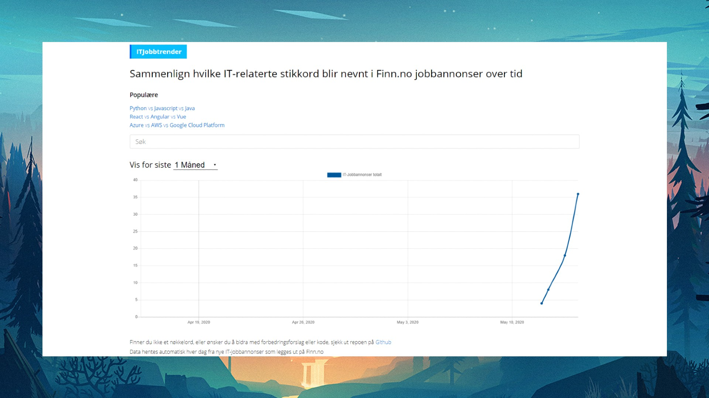
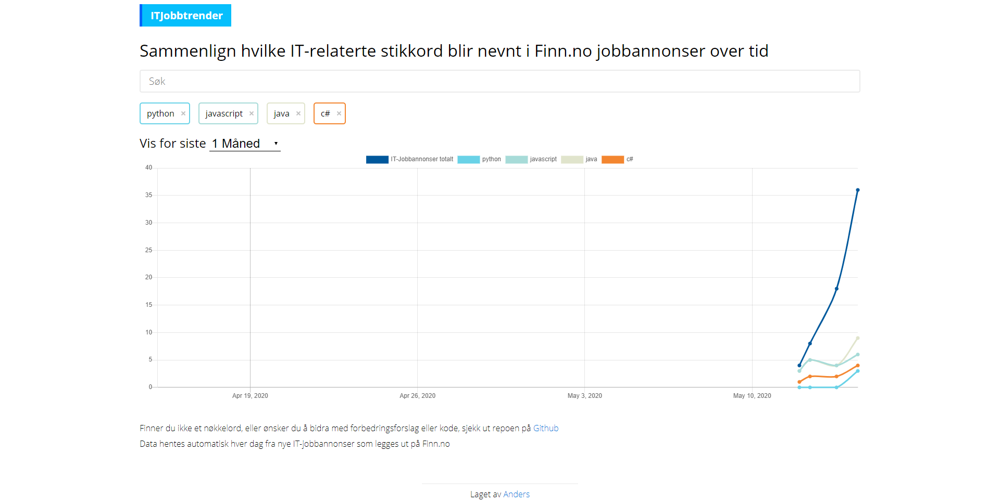
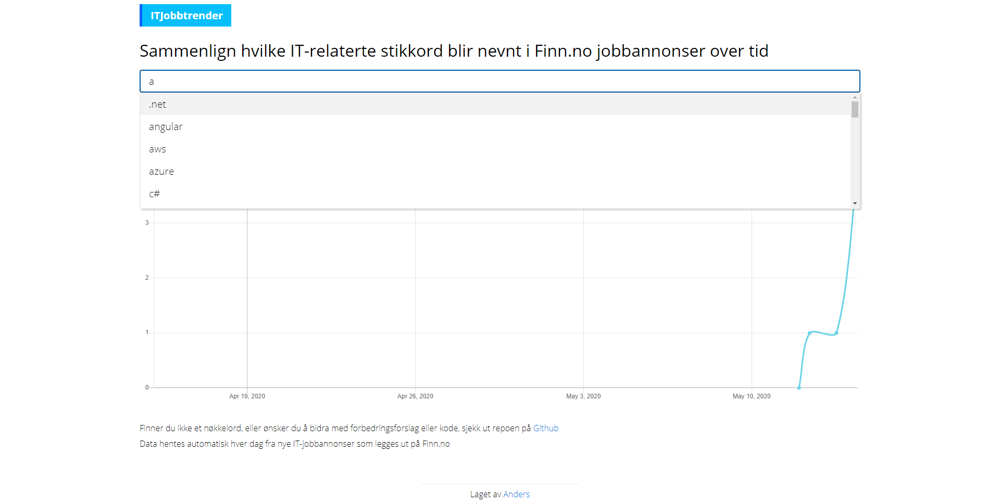
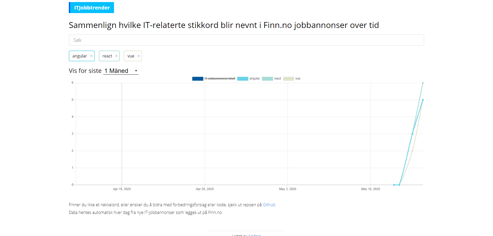

- React
- Firebase
- Google Cloud Functions
- Google Cloud Build

- 🌍https://itjobbtrender.no
- 👨‍💻https://github.com/anderspk/itjobbtrender.no

ITJobbtrender er en nettjeneste som søker gjennom de nye IT-jobbannonsene på Finn.no hver dag, og teller hvor mange av de nevner visse IT-relaterte nøkkelord.
Backenden er en "scheduled" Cloud Function som kjøres kl 10 hver morgen, og finner alle Finn.no IT-annonsene som ble lagt ut for "1 dag siden". Disse blir da brukt som utgangspunkt for å finne hvilke nøkkelord blir nevnt.

