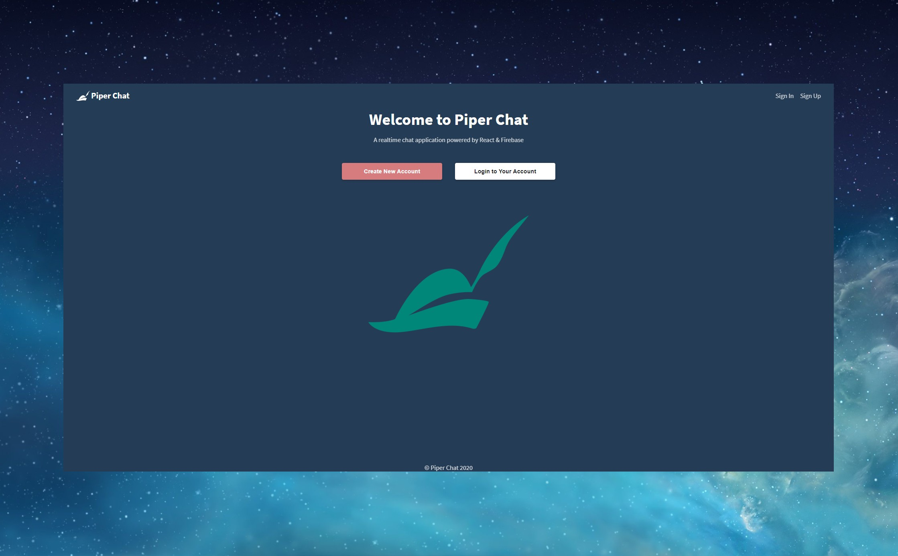
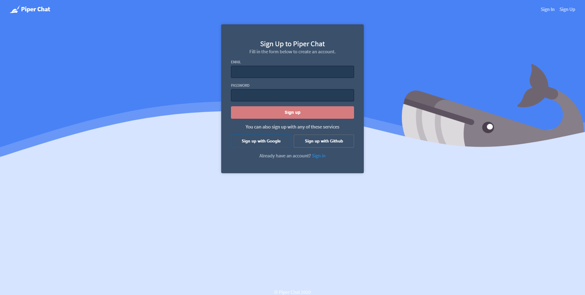
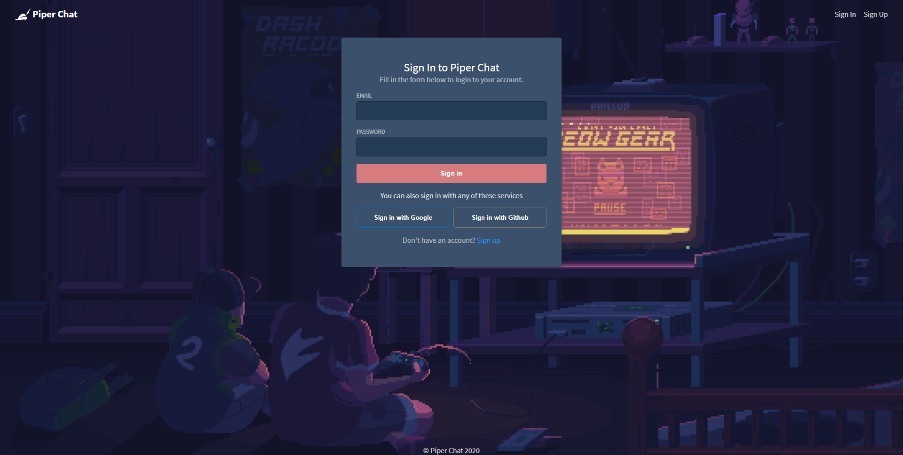

- React
- Firebase
- Github Actions

- 🌍https://piper-chat-e3915.web.app
- 👨‍💻https://github.com/anderspk/piper-chat

Piper Chat er et demo-prosjekt som bruker Firebase sin autentisering og Realtime Database for å skape en enkel chat-applikasjon. Github repoen buker Github Actions for CI/CD ved push til master branch.

